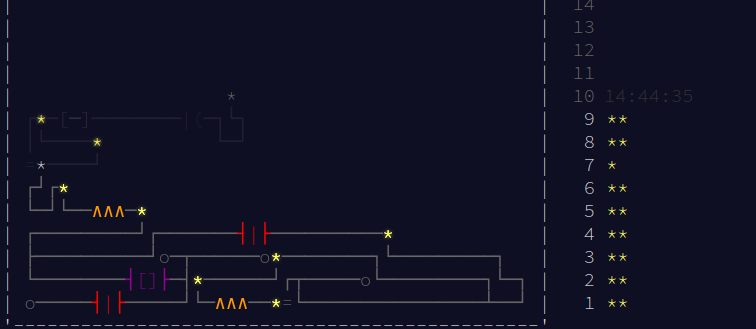

# advent-of-code-2017
Solutions to this year [Adevnt of Code](https://adventofcode.com/2017)

## What is Advent of Code?

> Advent of Code is a series of small programming puzzles for a variety of skill levels. They are self-contained and are just as appropriate for an expert who wants to stay sharp as they are for a beginner who is just learning to code. Each puzzle calls upon different skills and has two parts that build on a theme.
>
> ~ <cite>[Eric Wastl](http://was.tl/), creator of Advent of Code</cite>



## Prerequisites to run

- Node 8.4.0
- yarn 1.0.1 (examples containing `package.json`)

First few Python examples:
- Python 3.5.2

Other version of Node, yarn and Python might also work

## Where is what?

Each subfolder is named after the day on which coresponding task was released - eg. `1` means that folder contains the task released on December 1'st

Each subfolder contains:
- `input.txt` - my input for that day
- `test.txt` - (optional) test input
- `package.json` - (optional) if solution has externall dependencies

Either:
- `main.js` - single solution to both parts

Or:
- `first/main.js` - solution to the first part
- `second/main.js` - solution to the second part

## Running code

0. Make sure `main.js` has executable privilages
1. Run the code
```sh
   (path-to-task)/main.js 
```

## Conclusion

<!-- My conclusions -> expand this -->
<!-- Maybe a screenshot of the leaderboard after it's done? -->
